# [小程序 `canvas`](https://developers.weixin.qq.com/miniprogram/dev/component/canvas.html) 生成海报 -  解决屏幕图片失真，解决无法使用外网图片

> 源代码在最下方

## 最终结果

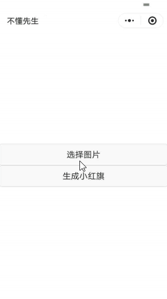

> canvas（画布） 元素用于在网页上绘制图形。画布是一个矩形区域，您可以控制其每一像素。canvas 拥有多种绘制路径、矩形、圆形、字符以及添加图像的方法。

## 注意

需要注意的是，目前的canvas可以简单分为两种。一种是传统网页中的canvas，一种是小程序中的canvas。两者的功能是完全一样的。只是标签的样式，和 `api` 略有区别而已。目前我们主要讲解小程序中的canvas。

# canvas 的应用场景

1. [在线游戏](http://www.jq22.com/yanshi20778)

2. [在线图表](https://www.echartsjs.com/examples/zh/index.html)

3. [页面特效](https://www.17sucai.com/pins/tag/3886.html)

4. 广告

5. **图片合成** *小程序中常见*

   1. 点我加速 

      ---

      

      

   2. 头像红旗

      ---
   
      
   
      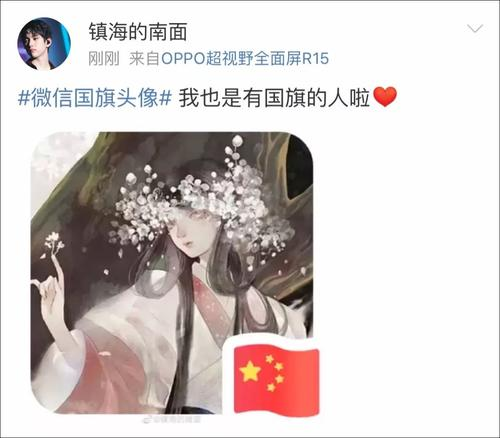
   
   3. 海报日历
   
      ---
   
      
   
      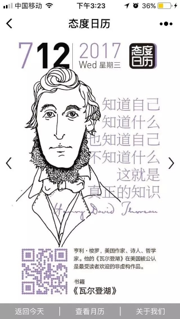
   
   4.  其他
   
      ---
   
      
   
      

---


# 简单体验

> 我们来画一条直线

在canvas中，把画直线的步骤分解为以下几步：

1. 编写标签
2. 获取画布实例
3. 定起点
4. 连接终点
5. 连线 （也叫描边）
6. 上色

## 编写标签

> 默认的宽高 为 300px * 150 px
>
> 不同于普通的标签，必须要提供一个属性 `canvas-id`，用于在 js中获取该对象（不是dom对象！！！）

```html
<canvas canvas-id="firstCanvas"></canvas>
```

##  获取画布实例

> 通过 canvas-id 来获取
>
> 该实例 不是dom元素，可以理解为另一种对象如 Math Date String等即可

**index.js**

```js
Page({
  onLoad() {
    // 1 获取画布上下文对象
    const context = wx.createCanvasContext("firstCanvas");
    console.log(context);
  }
})
```

## 点起点

在canvas中，存在一个坐标系 如下图：

> 我们在canvas中所讲的坐标都是相对于canvas内部坐标而言

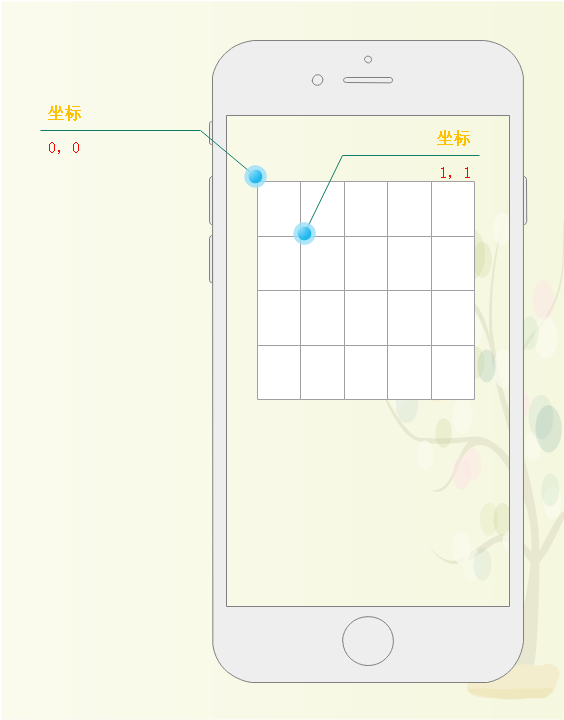


**定个起点**

```js
    // 定起点
    context.moveTo(10, 10);
```

## 定终点

```js
	// 定终点
	context.lineTo(300,150);
```

## 连线

```js
	// 连线
    context.stroke();
```

## 上色

```js
    // 上色
    context.draw();
```

## 完整代码

`index.wxml`

```html
<!-- 1 写标签 -->
<canvas canvas-id="firstCanvas"></canvas>
```

`index.js`

```js
Page({
  onLoad() {
    // 2 获取画布上下文对象
    const context = wx.createCanvasContext("firstCanvas");
    // 3 定起点
    context.moveTo(10, 10);
    // 4 定终点
    context.lineTo(300,150);
    // 5 连线
    context.stroke();
    // 6 上色
    context.draw();
  }
})
```

## 效果

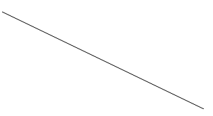


# 内置的其他规则图形

canvas中还封装了画规则图形的方法，如：

1. [画空心的矩形](https://developers.weixin.qq.com/miniprogram/dev/api/canvas/CanvasContext.strokeRect.html)

2. [画圆弧](https://developers.weixin.qq.com/miniprogram/dev/api/canvas/CanvasContext.arc.html)

3. [画实心的矩形](https://developers.weixin.qq.com/miniprogram/dev/api/canvas/CanvasContext.fillRect.html)

4. [画文字（把字符串画上去）](https://developers.weixin.qq.com/miniprogram/dev/api/canvas/CanvasContext.strokeText.html)

   


## [画矩形](https://developers.weixin.qq.com/miniprogram/dev/api/canvas/CanvasContext.strokeRect.html)

> CanvasContext.strokeRect(number x, number y, number width, number height)

> CanvasContext.strokeRect(画在画布的X,画在画布的Y,画多宽，画多高)

```js
    // 1 获取画布上下文对象
    const context = wx.createCanvasContext("firstCanvas");
    // 2 调用canvas内置的画“矩形”的方法
    context.strokeRect(10, 10, 100, 100);
    // 3 上色 
    context.draw();
```

### 效果

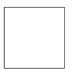

## [画圆弧](https://developers.weixin.qq.com/miniprogram/dev/api/canvas/CanvasContext.arc.html)

> CanvasContext.arc(number x, number y, number r, number sAngle, number eAngle, boolean counterclockwise)

> CanvasContext.arc(圆心的横坐标X,圆心的纵坐标Y, 半径的长度, 开始的弧度, 结束的弧度, ？是否反向来画)

### 代码

```js
  drawArc() {
    // 1 获取画布上下文对象
    const context = wx.createCanvasContext("firstCanvas");
    // context.arc(圆心的横坐标X,圆心的纵坐标Y, 半径的长度, 开始的弧度, 结束的弧度);
    // 2 调用内置的画 “圆弧” 的方法
    context.arc(100, 100, 100, this.angleToArc(0), this.angleToArc(90));
    // 3 开始描边
    context.stroke();
    // 4 上色
    context.draw();
  },
  /**
   * 将角度转为弧度
   * @param {number} angle 角度
   */
  angleToArc(angle) {
    return angle * Math.PI / 180;
  }
```

### 效果

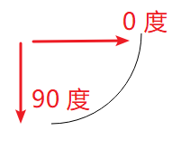

## [画实心的矩形](https://developers.weixin.qq.com/miniprogram/dev/api/canvas/CanvasContext.fillRect.html)

> CanvasContext.fillRect(number x, number y, number width, number height)

```js
    // 1 获取画布上下文对象
    const context = wx.createCanvasContext("firstCanvas");
    // 2 调用canvas内置的 画填充 “矩形”的方法
    context.fillRect(10, 10, 100, 100);
    // 3 上色 
    context.draw();
```

### 效果


## [画文字](https://developers.weixin.qq.com/miniprogram/dev/api/canvas/CanvasContext.strokeText.html)

> CanvasContext.strokeText(string text, number x, number y, number maxWidth)

> CanvasContext.strokeText(要绘制的文本, 文本起始点的 x 轴坐标, number y, 需要绘制的最大宽度，可选)

### 代码

```js
    // 1 获取画布上下文对象
    const context = wx.createCanvasContext("firstCanvas");
    // 2 画 “文字”
    context.strokeText("hello world", 100, 100);
    // 3 上色 
    context.draw();
```

### 效果


---

# 设置样式

经过以上的演示我们也发现，线条的颜色一直是黑色，这肯定是无法满足我们骚跳的心的。现在来学习一下关于设置canvas线条样式相关API。

1. 设置线条颜色
2. 设置线条粗细
3. 设置填充颜色
4. 设置文本大小


## [设置线条颜色](https://developers.weixin.qq.com/miniprogram/dev/api/canvas/CanvasContext.setStrokeStyle.html)

**特别要注意 **，`setStrokeStyle`是个函数，1.9.90版本后停止维护，使用以下的方式来修改。

1. ~~`CanvasContext.setStrokeStyle("red")`~~ 已过时，不推荐
2. `CanvasContext.strokeStyle="red";`  正解

### 代码

```js
    const context = wx.createCanvasContext("firstCanvas");
    context.moveTo(10, 10);
    context.lineTo(300, 150);
    // 5 修改颜色 需要在stroke之前修改
    context.strokeStyle = "red";
    context.stroke();
    context.draw();
```

### 效果

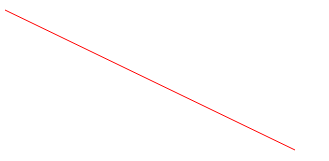

---

## 设置线条粗细

**特别要注意 **，`setLineWidth` 是个函数，1.9.90版本后停止维护，使用以下的方式来修改。

1. ~~`CanvasContext.setLineWidth(20)`~~ 已过时，不推荐
2. `CanvasContext.lineWidth=20;`  正解

### 代码

```js
    const context = wx.createCanvasContext("firstCanvas");
    context.moveTo(10, 10);
    context.lineTo(300, 150);
    // 设置线条宽度
    context.lineWidth = 20;
    context.stroke();
    context.draw();
```

### 效果

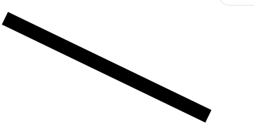

---


## 设置填充颜色

**特别要注意 **，`setFillStyle` 是个函数，1.9.90版本后停止维护，使用以下的方式来修改。

1. ~~`CanvasContext.setFillStyle("red")`~~ 已过时，不推荐
2. `CanvasContext.fillStyle="red";`  正解


### 代码

```js
    const context = wx.createCanvasContext("firstCanvas");
    // 设置填充颜色
    context.fillStyle = "red";
    context.fillRect(10, 10, 100, 100);
    context.draw();
```

### 效果


---


## 设置文本大小

**特别要注意 **，`setFontSize` 是个函数，1.9.90版本后停止维护，使用以下的方式来修改。

1. ~~`CanvasContext.setFontSize("20")`~~ 已过时，不推荐
2. `CanvasContext.font="sans-serif";`  正解
3. `font` 当前字体样式的属性。符合 [CSS font 语法](https://developer.mozilla.org/zh-CN/docs/Web/CSS/font) 的 DOMString 字符串，至少需要提供字体大小和字体族名。默认值为 10px sans-serif。

### 代码

```js
    const context = wx.createCanvasContext("firstCanvas");
    // 必须要同时提供 字号 和 字体
    context.font="10px  sans-serif";
    context.strokeText("10px", 10, 10);
    // 必须要同时提供 字号 和 字体
    context.font="50px  sans-serif";
    context.strokeText("50px", 50, 100);
    // 必须要同时提供 字号 和 字体
    context.font="80px  sans-serif";
    context.strokeText("80px", 80, 180);
    context.draw();
```

### 效果

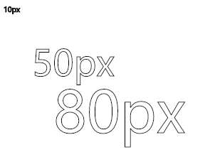


# 进阶

> 在本环节主要讲解稍微复杂一点的功能。要实现以下功能
>
> 但是需要先做一点技术铺垫

主要用到的api有：

1. 获取系统信息
2. 选择相册图片
3. 获取网络图片信息
4. canvas 描绘 图片到画布上
5. 将画布保存成一张图片
6. 将图片下载到本地

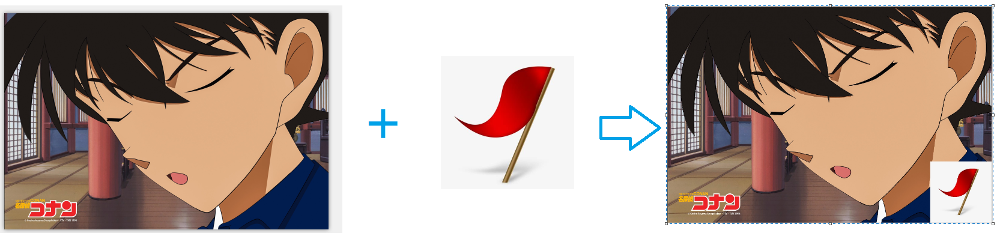


## 基本API

> 以下api是实现以上案例所必须的

### 获取系统信息

> 获取屏幕大小、设备像素比等

#### 代码

```js
wx.getSystemInfo({
  success (res) {
    console.log(res.model)
    console.log(res.pixelRatio)
    console.log(res.windowWidth)
    console.log(res.windowHeight)
    console.log(res.language)
    console.log(res.version)
    console.log(res.platform)
  }
})
```


### [选择相册图片](https://developers.weixin.qq.com/miniprogram/dev/api/media/image/wx.chooseImage.html)

> 从本地相册选择图片或使用相机拍照

#### 代码

```js
wx.chooseImage({
  count: 1,// 最多可以选择的图片张数
  sizeType: ['original', 'compressed'],// 所选的图片的尺寸
  sourceType: ['album', 'camera'],//  选择图片的来源
  success (res) {
    // tempFilePath可以作为img标签的src属性显示图片
    const tempFilePaths = res.tempFilePaths
  }
})
```

#### 代码

```js
wx.getSystemInfo({
  success (res) {
    console.log(res.model)
    console.log(res.pixelRatio)
    console.log(res.windowWidth)
    console.log(res.windowHeight)
    console.log(res.language)
    console.log(res.version)
    console.log(res.platform)
  }
})
```


### [获取网络图片信息](https://developers.weixin.qq.com/miniprogram/dev/api/media/image/wx.getImageInfo.html)

*获取图片信息。网络图片需先配置download域名才能生效。*

> canvas提供了将图片画到画布上的功能，但是要求所提供的图片必须是外网下的图片
>
> 因此可以借助该方法将网络图片变成本地图片，同时返回该图片的信息


#### 代码

```js
wx.getImageInfo({
  src: 'cloud://c-73e071.632d-c-73e071/92637.jpg',
  success (res) {
    console.log(res.width)
    console.log(res.height)
  }
})
```

#### [绘制图像到画布](https://developers.weixin.qq.com/miniprogram/dev/api/canvas/CanvasContext.drawImage.html)

> 不能使用本地图片，要使用外网图片的 必须要先 使用 `wx.getImageInfo` 下载到本地

有三个版本的写法：

- drawImage(imageResource, dx, dy)
- drawImage(imageResource, dx, dy, dWidth, dHeight)
- drawImage(imageResource, sx, sy, sWidth, sHeight, dx, dy, dWidth, dHeight) 
- 说明drawImage(图片路径, 原图的x, 原图的y, 原图的宽度, 原图的高度, 画布的x, 画布的y, 画多宽, 画多高) 

#### 代码

```js
context.drawImage('xxxx.jpg', 0, 0,100, 100);
```

### [将画布保存成一张图片](https://developers.weixin.qq.com/miniprogram/dev/api/canvas/wx.canvasToTempFilePath.html)

> 在 [draw()](https://developers.weixin.qq.com/miniprogram/dev/api/canvas/CanvasContext.draw.html) 回调里调用该方法才能保证图片导出成功

#### 代码

```js
wx.canvasToTempFilePath({
  x: 100,
  y: 200,
  width: 50,
  height: 50,
  destWidth: 100,
  destHeight: 100,
  canvasId: 'myCanvas',
  success(res) {
    console.log(res.tempFilePath)
  }
})
```


### [将图片下载到本地](https://developers.weixin.qq.com/miniprogram/dev/api/media/image/wx.saveImageToPhotosAlbum.html)

*保存图片到系统相册*

#### 代码

```js
wx.saveImageToPhotosAlbum({
  success(res) { }
})
```


## 案例实现

其实要实现一样案例，最麻烦的不是这些API的调用，而是如何根据不同的图片，合成**比例合适**的 **不模糊的图片**；

### 为什么说比例合适

因为在canvas中，只支持 `px` 单位，那么在使用`javascript`来描绘图片时，就不存在 `rpx`、`vw`、`%`这些相对单位了。只能依靠手动来计算。如，在 canvas中，*画出一个大小为 屏幕宽的一半 屏幕高的一半的矩形？*

### 为什么说不模糊

问题的原因还是因为 手机的屏幕 都是高清屏，具体的原因可以参照 [链接](https://www.baidu.com/s?wd=canvas%20图片模糊&rsv_spt=1&rsv_iqid=0x81d272c4001bc25e&issp=1&f=8&rsv_bp=1&rsv_idx=2&ie=utf-8&tn=baiduhome_pg&rsv_enter=1&rsv_dl=ib&rsv_sug3=24&rsv_sug1=6&rsv_sug7=100&rsv_sug2=0&inputT=7986&rsv_sug4=7986)

如我们想要生成图片大小为 100px * 100px，那么就需要将 canvas的大小设置为 `width = 图片的宽度 * 设备像素比`

`height = 图片的高度 * 设备像素比`


### 文件目录

1. `index` 首页
2. `result` 合成图片的页面

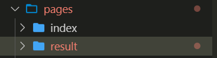

### 首页 index

#### index

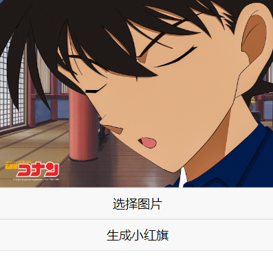

#### pages/index/index.wxml

```js
<!-- 用来显示 被选择的图片的 -->
<image mode="widthFix" src="{{src}}"></image>
<!-- 选择相册图片 -->
<button bindtap="handleTap">选择图片</button>
<!-- 跳转到 结果页面 -->
<button bindtap="handleCreateFlag">生成小红旗</button>
```

#### pages/index/index.js

主要实现3个功能

1. 点击 “选择图片” 将选择的图片打印到页面上
2. 将被 选择的图片 显示的页面上
3. 点击 “生成红旗”，跳转到结果页面（在结果页面完成生成）

```js
Page({
  data: {
    src: ""
  },
  // 选择图片
  handleTap() {
    wx.chooseImage({
      count: 1,
      sizeType: ['original', 'compressed'],
      sourceType: ['album', 'camera'],
      success: (result) => {
        this.setData({
          src: result.tempFilePaths[0]
        })
        // 保存图片路径
        wx.setStorageSync('src', this.data.src);
      }
    });
  },
  // 生成红旗
  handleCreateFlag() {
    // 跳转到结果页面
    wx.navigateTo({
      url: '/pages/result/index'
    });
  }
})
```


### 结果页面 result

#### result

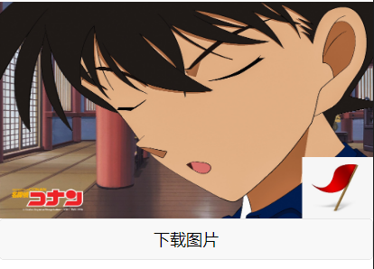

#### result/index.wxml

3个标签

1. canvas 标签，通过定位将其隐藏
2. image 标签，用来显示合成的图片
3. button 标签，用来点击 下载图片

```html
<!-- canvas 标签-->
<canvas class="cas" style="width:{{canvasWidth}};height:{{canvasHeight}};" canvas-id="firstCanvas"></canvas>
<!-- 用来显示 合成成功的图片 -->
<image class="res_image" mode="widthFix" src="{{resSrc}}"></image>
<!-- 点击下载图片 -->
<button bindtap="handleSave">下载图片</button>
```

#### result/index.wxss

两个样式

1. 把canvas藏起来（因为是 [原生组件](https://developers.weixin.qq.com/miniprogram/dev/component/native-component.html)，所以它的层级比一般的标签都要高（定位+zindex也无法解决））
2. 设置图片标签的样式

```css
page {
  overflow-x: hidden;
  overflow-y: auto;
  width: 100vw;
  height: 100vh;
}
.cas {
  position: absolute;
  top: 1000vw;
  left: 1000vh;
  z-index: -1;
  opacity: 0;
}
.res_image {
  width: 100%;
  display: block;
}

```

#### result/index.js

易错点：

1. 外网的图片，需要先将图片服务器添加到白名单中（否则真机调试会失败）
2. 没有动态设置 canvas的宽和高（参照第29、31行）

```js

import regeneratorRuntime from '../../lib/runtime/runtime';
import { getImageInfo, canvasToTempFilePath, saveImageToPhotosAlbum } from "../../wxAsync/index.js";
Page({
  data: {
    // 默认的canvas的宽度
    canvasWidth: 1,
    // 默认的canvas高度
    canvasHeight: 1,
    // 最终生成的图片路径
    resSrc: ""
  },
  // 全局变量
  saveImgSrc: "",
  async onLoad() {
    // 红旗图片
    const flagSrc = "https://632d-c-73e071-1252056196.tcb.qcloud.la/3434.jpg?sign=a4f1c2106d1e61551829c2f99820c0ba&t=1569678566";
    // const baseSrc = "https://632d-c-73e071-1252056196.tcb.qcloud.la/92637.jpg?sign=8952d1eaa69a35510418fe25dc25d6c5&t=1569678606";
    // 上个页面选择的图片路径 柯南图片
    const baseSrc = wx.getStorageSync("src");
    // 设备像素比
    const { pixelRatio } = wx.getSystemInfoSync();

    // 获取 画布实例
    const context = wx.createCanvasContext('firstCanvas');
    console.log(context);
    // 下载到本地的 柯南图片
    const baseImg = await getImageInfo(baseSrc);
    // 下载到本地的 红旗图片
    const flagImg = await getImageInfo(flagSrc);
    // 将canvas的宽度设置中 图片的宽度
    const canvasWidth = baseImg.width + "px";
    // 将canvas的宽度设置中 图片的高度
    const canvasHeight = baseImg.height + "px";
    //  setData 函数用于将数据从逻辑层发送到视图层（异步），同时改变对应的 this.data 的值（同步）。
    // 因此需要将 描绘 图片的步骤写在回调中，否则 真机调试有bug！
    this.setData({ canvasWidth, canvasHeight }, () => {
      // 如果个别机型出现图片失败错误，可以加上定时器。
      setTimeout(() => {
        // 先将柯南 描绘到画布上
        context.drawImage(baseImg.path, 0, 0, baseImg.width, baseImg.height);
        // 把红旗 描绘到画布上
        context.drawImage(flagImg.path, baseImg.width - (pixelRatio * 50), baseImg.height - (pixelRatio * 50), (pixelRatio * 50), (pixelRatio * 50));
        context.draw(true, async () => {
          // 将 画布生成 成图片
          const res1 = await canvasToTempFilePath({
            canvasId: "firstCanvas"
          });
          // 让图片显示 合成后的效果
          this.setData({ resSrc: res1.tempFilePath })
          // 保存起来，当点击保存图片时调用
          this.saveImgSrc = res1.tempFilePath;
        });
      }, 100);
    });
  },

  // 点击保存图片
  handleSave() {
    saveImageToPhotosAlbum(this.saveImgSrc);
  }
})

```


# github地址

```
https://github.com/itcastWsy/AppletPoster.git
```

